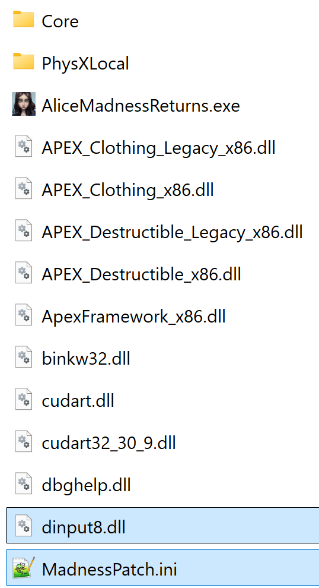
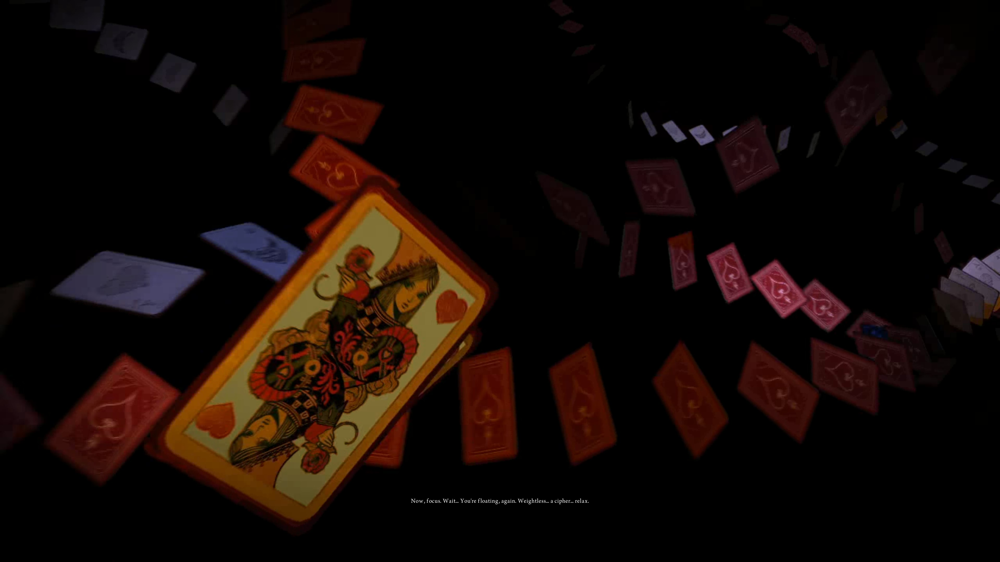
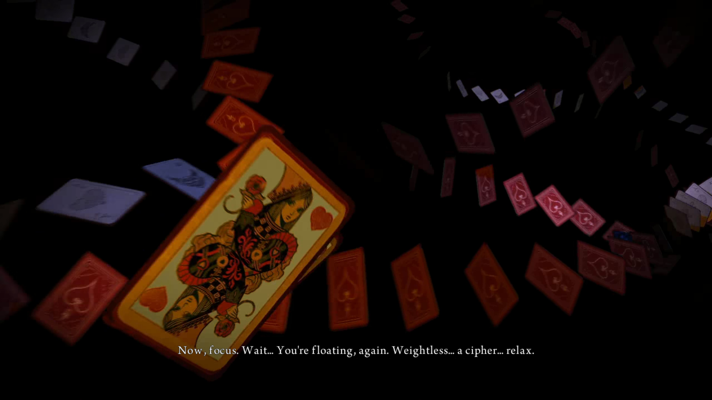
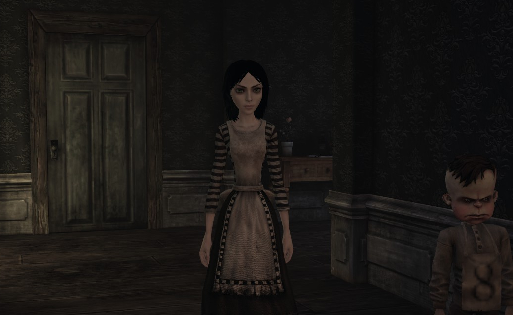
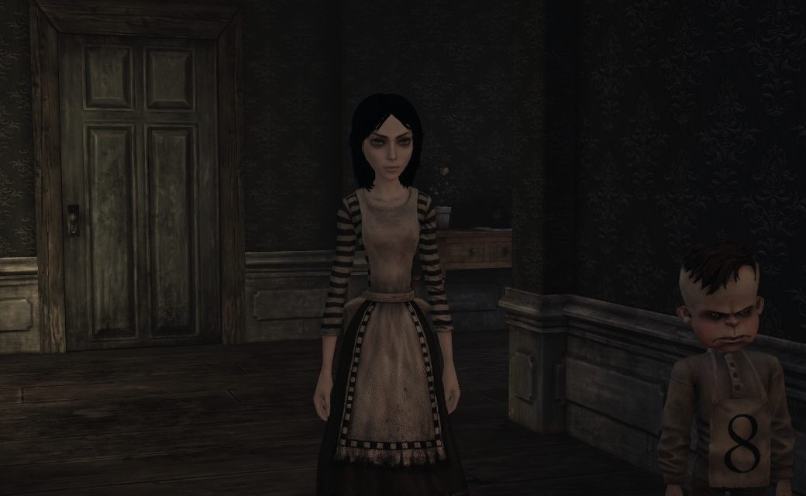
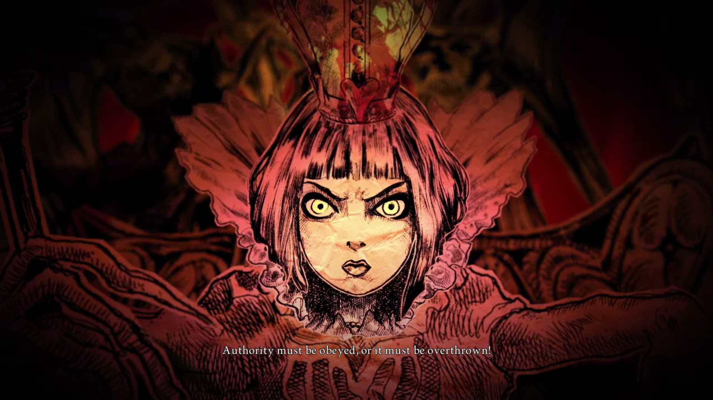
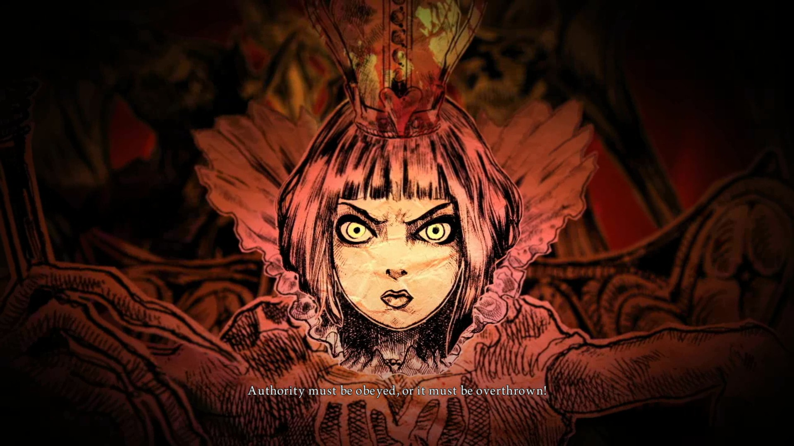
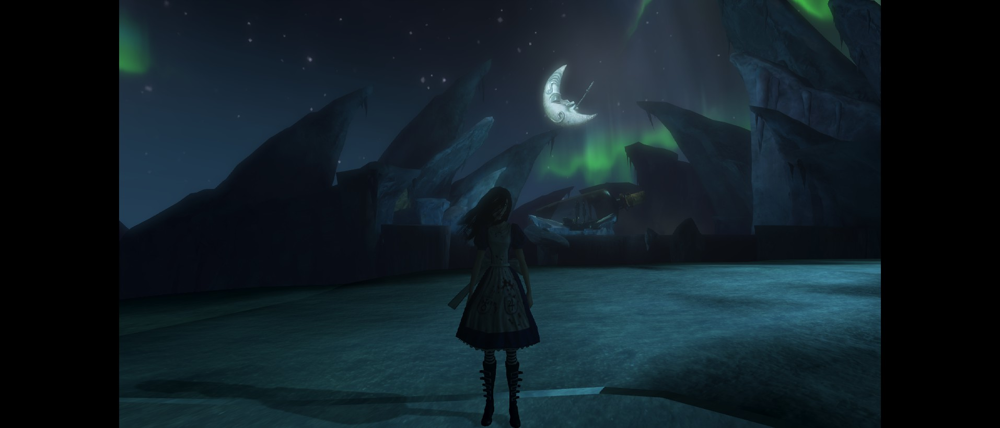
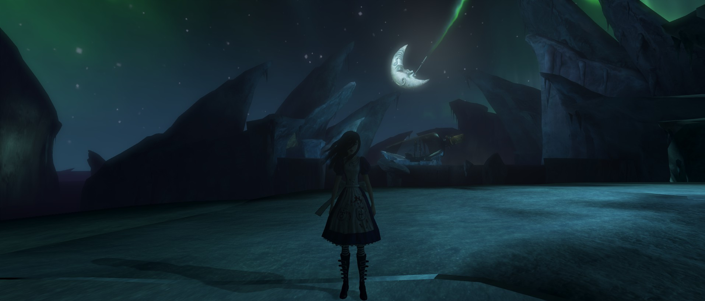

  

A patch that fixes various issues in the PC port of Alice: Madness Returns.

## How to Install

> [!NOTE]  
> Compatible with the Steam and EA App versions of Alice: Madness Returns.
>
> **Download**: [MadnessPatch.zip](https://github.com/Wemino/MadnessPatch/releases/latest/download/MadnessPatch.zip)  
> Extract the contents of the zip file into the game's `Win32` folder, which contains the `AliceMadnessReturns.exe` file.
>
> 
>
> Directory path for Steam:  
> `SteamLibrary\steamapps\common\Alice Madness Returns\Binaries\Win32`
>
> Directory path for EA App:  
> `EA\Alice Madness Returns\Game\Alice2\Binaries\Win32`

> [!WARNING]
If the game doesn’t start on Windows after installing the patch, try updating the latest Microsoft Visual C++ Redistributable (x86).  
You can download it here: https://aka.ms/vs/17/release/vc_redist.x86.exe

> [!TIP]  
> If you own the remastered version of *American McGee's Alice*, check out [VorpalFix](https://github.com/Wemino/VorpalFix)!

### Steam Deck/Linux Specific Instructions (Windows users can skip this)

> [!WARNING]
> To launch the game on Steam Deck or Linux, open the game's properties in Steam and include `WINEDLLOVERRIDES="dinput8=n,b" %command%` in the launch options.

# Features

## Subtitle Font Scaling

Scales subtitles properly on high-resolution displays. The game was originally designed for consoles and limits subtitle size above 720p, making text harder to read on 1080p or higher. This fix removes that limit so subtitles scale correctly with your resolution.

If you want a different size, you can fine-tune it with `FontScalingFactor` in `MadnessPatch.ini`.

  <table>
    <tr>
      <td width="50%"></td>
      <td width="50%"></td>
    </tr>
    <tr>
      <td align="center">4K Vanilla</td>
      <td align="center">4K MadnessPatch</td>
    </tr>
  </table>

## High FPS Fixes

Fix multiple physics and gameplay issues that occur at high framerates by preventing hair and dress physics from becoming unstable and ensuring consistent hitbox size for projectiles like the Pepper Grinder.

## Crashes and Infinite Loading Fix

Prevents crashes and infinite loading screens caused by race conditions that occur more frequently at higher framerates during map transitions.

## Input Binding Fix

Fix issues where certain input mappings fail to respond correctly. This particularly affects the umbrella key and other special action bindings that may not register during the input initialization process.

## Force High Resolution Textures

The game normally loads blurry textures first and then sharpens them as you get closer, which was meant for consoles but looks distracting on PC. This patch forces the highest texture resolution from the start and improves texture streaming, so you don’t see textures popping into clarity as you move around. It also slightly reduces mipmap bias, improving texture sharpness at a distance.

  <table>
    <tr>
      <td width="50%"></td>
      <td width="50%"></td>
    </tr>
    <tr>
      <td align="center">Vanilla</td>
      <td align="center">Force High Res</td>
    </tr>
  </table>

> **Note**: May increase VRAM usage and impact performance on systems with limited graphics memory.

## Bink Video Color Space Fix

Switched the Bink video color profile from BT.601 to BT.709, which is the standard for HD video, so pre-rendered videos now show correct colors, especially deep reds and warm tones.

  <table>
    <tr>
      <td width="50%"></td>
      <td width="50%"></td>
    </tr>
    <tr>
      <td align="center">Vanilla (BT.601)</td>
      <td align="center">MadnessPatch (BT.709)</td>
    </tr>
  </table>

## Input Improvements

### Disable Mouse Acceleration

Stops the game from ramping up mouse speed when you start moving it.

### Disable Controller Acceleration

Turns off the same acceleration system for controllers. The game speeds up your look input as the stick starts moving, and this option removes that so the stick behaves more consistently.

Enable with `DisableControllerAcceleration = 1` in `MadnessPatch.ini`.

### Disable Mouse Smoothing

Turns off camera smoothing so the view responds instantly to your mouse movements.

Enable with `DisableMouseSmoothing = 1` in `MadnessPatch.ini`.

## Ultrawide FOV Fix

Removes pillarboxing and adjusts the FOV for ultrawide monitors.

  <table>
    <tr>
      <td></td>
    </tr>
    <tr>
      <td align="center">Vanilla 21:9 (Cropped Viewport)</td>
    </tr>
    <tr>
      <td></td>
    </tr>
    <tr>
      <td align="center">MadnessPatch 21:9</td>
    </tr>
  </table>

## Skip Cutscenes with Enter

Prevent accidental cutscene skips by moving the skip key from Space (jump) to Enter.

Enable with `SkipCutscenesWithEnter = 1` in `MadnessPatch.ini`.

## Framerate Limiter

Allow to set a framerate limit easily without editing the game’s files.

Set `MaxFPS` in `MadnessPatch.ini` (0 = disable, recommended maximum: 120).

## Complete Edition DLC Unlock

Unlocks all Complete Edition costumes, weapons, and adds a menu option to launch the original Alice game without editing the game’s files.

## Improved Window Management

Fixes window management to allow standard Windows functionality:
- Close the game using ALT+F4.
- Use the Windows key to access the Start Menu or switch applications at any time. (previously blocked after clicking back into the game window)
- Free mouse cursor when the game loses focus in windowed mode. (cursor is no longer trapped when alt-tabbing or clicking outside the window)

## Windowed Mode

Forces the game to run in windowed mode instead of fullscreen.

Enable with `UseWindowed = 1` in `MadnessPatch.ini`.

## Alice 1 Installation Check

Displays a warning prompt if the original American McGee's Alice is not found in the expected installation directory when attempting to launch it from within Alice: Madness Returns.

## Disable Legacy Driver Hacks

Turns off old Unreal Engine 3 driver workarounds that were meant for very old GPUs (pre-2010). These hacks can slow down modern graphics cards by forcing the game to use outdated rendering methods. Disabling them lets the game run more efficiently on current hardware.

## Skip Intro Videos

Bypasses intro videos on game launch:
- **SkipEAIntro**: Skips the EA logo video
- **SkipSHIntro**: Skips the Spicy Horse studio logo video  
- **SkipUEIntro**: Skips the Unreal Engine logo video

Enable individually in `MadnessPatch.ini`.

## Configuration

All features can be customized via the `MadnessPatch.ini` file.

# Credits

- [safetyhook](https://github.com/cursey/safetyhook) for hooking.  
- [mINI](https://github.com/metayeti/mINI) for INI file handling.  
- [CRASHARKI](https://github.com/CRASHARKI) for the logo.
